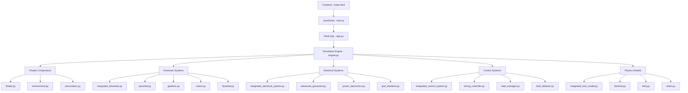

# KPP Simulation: Module Reference Calling Patterns

## 📊 Module Dependency Graph



## 🔗 Detailed Module Reference Calling

### **1. Frontend → Backend Communication**

#### **HTTP Request Mapping:**
```
Frontend Action              Flask Route                 Engine Method
─────────────────────────────────────────────────────────────────────
Start Button Click      →   @app.route("/start")    →   engine.run()
Parameter Form Submit   →   @app.route("/update_")   →   engine.update_params()
Pulse Button Click      →   @app.route("/trigger_")  →   engine.trigger_pulse()
Stop Button Click       →   @app.route("/stop")      →   engine.running = False
Reset Button Click      →   @app.route("/reset")     →   engine.reset()
```

#### **Real-time Data Flow:**
```
Simulation Loop         →   engine.log_state()       →   data_queue.put()
Data Queue             →   @app.route("/stream")     →   SSE Response
SSE Event              →   JavaScript EventSource   →   updateFromSSEData()
Chart Updates          →   Chart.js addData()       →   Visual Display
```

### **2. Simulation Engine Internal References**

#### **Core Engine (engine.py) Method Calls:**

```python
class SimulationEngine:
    def __init__(self, params, data_queue):
        # Component Initialization Chain
        self.environment = Environment()
        self.pneumatics = PneumaticSystem(target_pressure=params.get('target_pressure', 5.0))
        
        # Drivetrain System Assembly
        self.integrated_drivetrain = create_standard_kpp_drivetrain(drivetrain_config)
        # ↓ This creates:
        #   → Sprocket(config)
        #   → Gearbox(config) 
        #   → Clutch(config)
        #   → Flywheel(config)
        
        # Electrical System Assembly  
        self.integrated_electrical_system = create_standard_kmp_electrical_system(electrical_config)
        # ↓ This creates:
        #   → AdvancedGenerator(config)
        #   → PowerElectronics(config)
        #   → GridInterface(config)
        
        # Control System Assembly
        self.integrated_control_system = create_standard_kpp_control_system(control_config)
        # ↓ This creates:
        #   → TimingController(config)
        #   → LoadManager(config)
        #   → FaultDetector(config)
        #   → GridStabilityController(config)
        
        # Physics Models
        self.enhanced_loss_model = create_standard_kpp_enhanced_loss_model(loss_config)
        self.fluid_system = Fluid(params)
        self.thermal_model = ThermalModel(params)
        self.chain = Chain(params)
        
        # Individual Components
        self.floaters = [Floater(...) for i in range(num_floaters)]
        self.generator = AdvancedGenerator(generator_config)
    
    def step(self, dt):
        """Main simulation step with component update sequence"""
        
        # 1. Pneumatic System Update
        self.pneumatics.update(dt)
        # ↓ Calls:
        #   → ThermodynamicProperties.calculate_state()
        #   → CompressionThermodynamics.update()
        #   → ExpansionThermodynamics.update()
        
        # 2. Fluid & Thermal Updates (Advanced Physics)
        self.fluid_system.update_state()
        # ↓ Calls:
        #   → H1Effect.calculate_nanobubble_density()
        #   → FluidProperties.update_effective_density()
        
        self.thermal_model.update_state()
        # ↓ Calls:
        #   → H2Effect.calculate_thermal_expansion()
        #   → ThermalBuoyancy.update_buoyancy_enhancement()
        
        # 3. Floater Updates (Core Physics)
        for floater in self.floaters:
            floater.update(dt, self.environment)
            # ↓ Each floater calls:
            #   → compute_buoyant_force()
            #   → compute_drag_force() 
            #   → update_position()
            #   → compute_chain_torque()
        
        # 4. Force Aggregation
        total_chain_torque = sum(f.compute_chain_torque(self.sprocket_radius) for f in self.floaters)
        
        # 5. Drivetrain System Update
        drivetrain_output = self.integrated_drivetrain.update(total_chain_torque, electrical_load_torque, dt)
        # ↓ This cascades through:
        #   → Sprocket.update() → calculates chain tension and speed
        #   → Gearbox.update() → applies gear ratios and efficiency losses
        #   → Clutch.update() → determines engagement and torque transfer  
        #   → Flywheel.update() → manages rotational energy storage
        
        # 6. Electrical System Update
        electrical_output = self.integrated_electrical_system.update(mechanical_torque, shaft_speed, dt, electrical_config)
        # ↓ This cascades through:
        #   → AdvancedGenerator.update() → electromagnetic modeling
        #   → PowerElectronics.update() → AC-DC-AC conversion
        #   → GridInterface.update() → synchronization and grid connection
        
        # 7. Control System Update
        control_output = self.integrated_control_system.update(system_state, dt)
        # ↓ This cascades through:
        #   → TimingController.update() → pulse timing optimization
        #   → LoadManager.update() → power output regulation
        #   → FaultDetector.update() → safety monitoring
        #   → GridStabilityController.update() → grid service provision
        
        # 8. Enhanced Loss Modeling
        enhanced_state = self.enhanced_loss_model.update(system_power_flow, dt)
        # ↓ This cascades through:
        #   → DrivetrainLosses.calculate() → mechanical efficiency
        #   → ElectricalLosses.calculate() → electrical efficiency  
        #   → ThermalModel.update() → temperature effects
        
        # 9. Grid Services (Advanced Features)
        grid_services_output = self.grid_services_coordinator.update(grid_conditions, control_commands, dt)
        # ↓ This cascades through:
        #   → FrequencyServices.update() → primary/secondary frequency response
        #   → VoltageServices.update() → voltage regulation and reactive power
        #   → EconomicServices.update() → market participation and optimization
        
        # 10. Data Logging and Output
        self.log_state(power_output, torque, ...)
        # ↓ This calls:
        #   → collect_component_states()
        #   → format_output_data()
        #   → data_queue.put(state)
```

### **3. Component-to-Component Reference Patterns**

#### **Floater Physics Chain:**
```python
# floater.py
class Floater:
    def update(self, dt, environment):
        # References to external systems:
        buoyant_force = self.compute_buoyant_force()
        # ↓ Uses:
        #   → environment.water_density
        #   → fluid_system.effective_density (H1 effect)
        #   → thermal_model.buoyancy_enhancement (H2 effect)
        
        drag_force = self.compute_drag_force()
        # ↓ Uses:
        #   → environment.water_viscosity
        #   → self.velocity (state feedback)
        
        chain_torque = self.compute_chain_torque(sprocket_radius)
        # ↓ References:
        #   → sprocket.radius (from drivetrain)
        #   → chain.position (geometric calculations)
```

#### **Drivetrain Component Chain:**
```python
# integrated_drivetrain.py  
class IntegratedDrivetrain:
    def update(self, chain_tension, electrical_load_torque, dt):
        # 1. Sprocket converts chain force to rotational torque
        sprocket_output = self.sprocket.update(chain_tension, dt)
        # ↓ sprocket.py references:
        #   → chain_tension (from floaters)
        #   → sprocket.radius (mechanical advantage)
        
        # 2. Gearbox applies speed/torque conversion
        gearbox_output = self.gearbox.update(sprocket_output['torque'], sprocket_output['speed'], dt)
        # ↓ gearbox.py references:
        #   → gear_stages[].ratio (speed conversion)
        #   → gear_stages[].efficiency (loss modeling)
        
        # 3. Clutch manages torque transfer to flywheel
        clutch_output = self.clutch.update(gearbox_output['torque'], gearbox_output['speed'], dt)
        # ↓ clutch.py references:
        #   → engagement_threshold (control logic)
        #   → torque_capacity (mechanical limits)
        
        # 4. Flywheel provides energy storage and smoothing
        flywheel_output = self.flywheel.update(clutch_output['torque'], electrical_load_torque, dt)
        # ↓ flywheel.py references:
        #   → moment_of_inertia (energy storage capacity)
        #   → electrical_load_torque (from generator)
```

#### **Electrical System Component Chain:**
```python
# integrated_electrical_system.py
class IntegratedElectricalSystem:
    def update(self, mechanical_torque, shaft_speed, dt, control_commands):
        # 1. Generator electromagnetic modeling
        generator_output = self.generator.update(shaft_speed, load_factor, dt)
        # ↓ advanced_generator.py references:
        #   → electromagnetic_model (torque calculations) 
        #   → efficiency_map (loss calculations)
        #   → thermal_model (temperature effects)
        
        # 2. Power electronics conversion
        pe_output = self.power_electronics.update(generator_power, generator_voltage, generator_frequency, grid_conditions, dt)
        # ↓ power_electronics.py references:
        #   → rectifier_efficiency (AC-DC conversion)
        #   → inverter_efficiency (DC-AC conversion)
        #   → transformer_efficiency (voltage matching)
        
        # 3. Grid interface and synchronization
        grid_output = self.grid_interface.update(pe_output['output_power'], grid_conditions, dt)
        # ↓ grid_interface.py references:
        #   → synchronization_controller (phase/frequency matching)
        #   → power_quality_monitor (harmonic analysis)
        #   → protection_systems (fault detection)
```

### **4. Data Structure Reference Patterns**

#### **State Data Propagation:**
```python
# Data flows through nested dictionaries with specific key patterns

floater_state = {
    'position': floater.position,           # → Used by: chain.py, visualization
    'velocity': floater.velocity,           # → Used by: drag calculations, control
    'is_filled': floater.is_filled,         # → Used by: pneumatics.py, optimization
    'buoyant_force': floater.buoyant_force  # → Used by: torque calculations, analysis
}

drivetrain_state = {
    'sprocket_torque': sprocket.torque,     # → Used by: power calculations
    'gearbox_output_torque': gearbox.output_torque,  # → Used by: generator input
    'flywheel_speed_rpm': flywheel.speed,   # → Used by: electrical system
    'clutch_engaged': clutch.engaged        # → Used by: control system, display
}

electrical_state = {
    'generator_power': generator.electrical_power,    # → Used by: grid interface
    'grid_power_output': grid.power_output,          # → Used by: main power display
    'synchronization_status': grid.synchronized,     # → Used by: control system
    'load_factor': electrical.load_factor            # → Used by: optimization
}
```

#### **Configuration Parameter Mapping:**
```python
# Parameters flow from frontend through multiple levels of configuration objects

frontend_params = {
    'num_floaters': 8,
    'floater_volume': 0.3,
    'sprocket_radius': 0.5,
    'flywheel_inertia': 50.0
}

# ↓ Mapped to component configs:

floater_config = {
    'volume': params['floater_volume'],      # → floater.py initialization
    'mass': params['floater_mass_empty'],    # → floater.py physics
    'area': params['floater_area']           # → floater.py drag calculations
}

drivetrain_config = {
    'sprocket_radius': params['sprocket_radius'],     # → sprocket.py torque calculation
    'flywheel_inertia': params['flywheel_inertia'],   # → flywheel.py energy storage
    'gear_ratios': params['gear_ratios']              # → gearbox.py speed conversion
}

electrical_config = {
    'rated_power': params['target_power'],            # → generator.py capacity
    'rated_speed': params['target_rpm'],              # → generator.py synchronous speed
    'load_management': params['load_management']      # → control.py behavior
}
```

## 🎯 Critical Reference Points

### **Cross-Module Dependencies:**
1. **Floaters → Drivetrain**: `chain_torque` calculations
2. **Drivetrain → Electrical**: `mechanical_torque` and `shaft_speed` 
3. **Electrical → Drivetrain**: `electrical_load_torque` feedback
4. **Control → All Systems**: `control_commands` and `setpoints`
5. **Physics Models → Floaters**: `effective_density`, `buoyancy_enhancement`

### **State Feedback Loops:**
1. **Power Control Loop**: `target_power → load_factor → generator_torque → electrical_load → drivetrain_speed → generator_frequency → power_output`
2. **Efficiency Optimization**: `system_losses → control_adjustments → component_setpoints → improved_efficiency`
3. **Safety Monitoring**: `fault_detection → emergency_response → system_shutdown → safe_state`

This comprehensive module reference analysis shows how the KPP simulation creates a complex web of interdependent components that work together to simulate realistic power generation physics while maintaining clean interfaces and data flow patterns.
