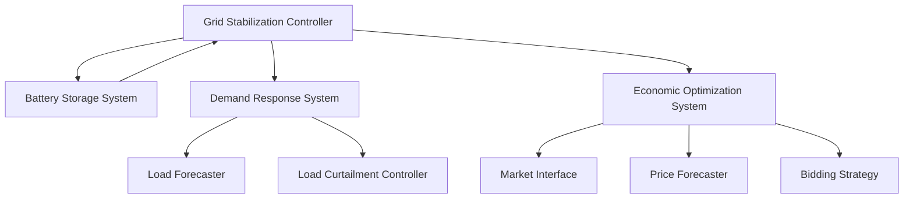

# Phase 4: Grid Services Framework Documentation

## Overview
Phase 4 implements the grid services framework, integrating energy storage, demand response, and economic optimization systems with the core KPP simulator. This document provides comprehensive guidance on the implementation, configuration, and operation of these services.

## Table of Contents
1. [Architecture](#architecture)
2. [Service Integration](#service-integration)
3. [Configuration Guide](#configuration-guide)
4. [Performance Optimization](#performance-optimization)
5. [Troubleshooting Guide](#troubleshooting-guide)

## Architecture

### Core Components
- **Grid Services Coordinator**: Central orchestrator for all grid services
- **Battery Storage System**: Energy storage and grid stabilization
- **Demand Response System**: Load management and curtailment
- **Economic Optimization**: Market participation and revenue optimization

### Service Hierarchy


## Service Integration

### Grid Services Coordinator
The coordinator manages service prioritization and resource allocation:

```python
# Example: Service Request
coordinator.request_service(
    service_type=ServiceType.FREQUENCY_RESPONSE,
    priority=ServicePriority.HIGH,
    magnitude=100.0,
    duration=timedelta(hours=1)
)
```

### Battery Storage System
Provides energy storage and grid support services:

```python
# Example: Storage Service Configuration
storage_config = StorageConfiguration(
    capacity=1000.0,  # kWh
    max_power=500.0,  # kW
    min_soc=0.1,
    max_soc=0.9,
    charge_efficiency=0.95,
    discharge_efficiency=0.95
)
```

### Demand Response System
Manages load forecasting and curtailment:

```python
# Example: Load Curtailment
curtailment_params = {
    'target_reduction': 100.0,  # kW
    'duration': timedelta(hours=2),
    'ramp_time': timedelta(minutes=15)
}
```

### Economic Optimization
Handles market participation and revenue optimization:

```python
# Example: Bidding Strategy
strategy = optimizer.optimize_strategy(
    available_capacity=100.0,
    time_horizon=timedelta(hours=24)
)
```

## Configuration Guide

### System Configuration
Key configuration parameters for each component:

#### Grid Services Coordinator
```python
COORDINATOR_CONFIG = {
    'available_capacity': 1000.0,  # kW
    'service_priorities': {
        'frequency_response': 'HIGH',
        'voltage_support': 'MEDIUM',
        'energy_arbitrage': 'LOW'
    },
    'update_interval': 1.0  # seconds
}
```

#### Battery Storage System
```python
STORAGE_CONFIG = {
    'capacity': 1000.0,  # kWh
    'max_power': 500.0,  # kW
    'efficiency': 0.95,
    'response_time': 0.1  # seconds
}
```

#### Demand Response
```python
DEMAND_RESPONSE_CONFIG = {
    'forecast_horizon': 24,  # hours
    'min_reduction': 50.0,  # kW
    'max_reduction': 200.0,  # kW
    'ramp_rate': 10.0  # kW/minute
}
```

#### Economic Optimization
```python
ECONOMIC_CONFIG = {
    'market_update_interval': 300,  # seconds
    'min_bid_size': 100.0,  # kW
    'price_threshold': 50.0,  # $/MWh
    'risk_tolerance': 0.2
}
```

## Performance Optimization

### Resource Allocation
Optimize resource allocation based on service priorities:

1. **High Priority Services**
   - Frequency response
   - Emergency demand response
   - Critical grid support

2. **Medium Priority Services**
   - Voltage support
   - Peak shaving
   - Load balancing

3. **Low Priority Services**
   - Energy arbitrage
   - Non-critical demand response
   - Market participation

### Response Time Optimization
Strategies to minimize service response times:

1. **Pre-allocation of Resources**
   - Reserve capacity for high-priority services
   - Maintain minimum state of charge
   - Keep critical systems in standby

2. **Parallel Processing**
   - Independent service execution
   - Asynchronous market updates
   - Concurrent data processing

3. **Caching and Prediction**
   - Cache frequent calculations
   - Predict upcoming service requests
   - Pre-compute common scenarios

## Troubleshooting Guide

### Common Issues and Solutions

#### Service Coordination Issues
1. **Symptom**: Services competing for resources
   - **Check**: Service priority configuration
   - **Solution**: Adjust priority levels and capacity limits

2. **Symptom**: Slow service response
   - **Check**: System load and resource allocation
   - **Solution**: Optimize resource distribution

#### Battery Storage Issues
1. **Symptom**: Insufficient capacity
   - **Check**: State of charge management
   - **Solution**: Adjust charging/discharging thresholds

2. **Symptom**: Poor efficiency
   - **Check**: Operating temperature and cycling patterns
   - **Solution**: Optimize charging strategies

#### Demand Response Issues
1. **Symptom**: Missed reduction targets
   - **Check**: Load forecasting accuracy
   - **Solution**: Update forecasting models

2. **Symptom**: Customer complaints
   - **Check**: Curtailment patterns
   - **Solution**: Adjust ramping rates

#### Economic Optimization Issues
1. **Symptom**: Suboptimal revenue
   - **Check**: Market participation strategy
   - **Solution**: Update bidding parameters

2. **Symptom**: High risk exposure
   - **Check**: Risk management settings
   - **Solution**: Adjust risk tolerance levels

### Diagnostic Tools

#### Performance Monitoring
```python
# Example: Get system metrics
metrics = coordinator.get_overall_performance()
print(f"Service uptime: {metrics['service_uptime']}")
print(f"Response time: {metrics['average_response_time']}")
print(f"Service accuracy: {metrics['service_accuracy']}")
```

#### Error Logging
```python
# Example: Enable detailed logging
logging.basicConfig(
    level=logging.DEBUG,
    format='%(asctime)s - %(name)s - %(levelname)s - %(message)s'
)
```

### Emergency Procedures
1. **Service Failure**
   - Activate backup systems
   - Switch to failsafe mode
   - Notify system operators

2. **Market Disruption**
   - Switch to local optimization
   - Maintain essential services
   - Implement emergency bidding strategy

3. **System Overload**
   - Initiate load shedding
   - Prioritize critical services
   - Execute emergency demand response 