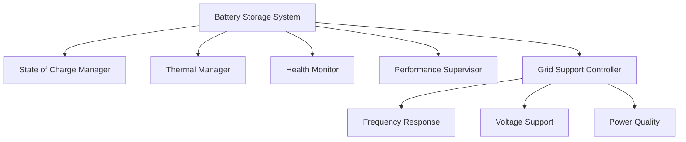

# Battery Storage System Documentation

## Overview
The Battery Storage System (BSS) provides energy storage capabilities and grid support services for the KPP simulator. It manages state of charge, implements charging/discharging strategies, and provides various grid services.

## Features
- State of charge management
- Grid stabilization support
- Energy arbitrage
- Performance monitoring
- Thermal management
- Health monitoring

## System Architecture

### Components


## Configuration

### Basic Configuration
```python
BATTERY_CONFIG = {
    # Physical parameters
    'capacity': 1000.0,          # kWh
    'max_power': 500.0,          # kW
    'min_soc': 0.1,             # 10%
    'max_soc': 0.9,             # 90%
    
    # Efficiency parameters
    'charge_efficiency': 0.95,   # 95%
    'discharge_efficiency': 0.95, # 95%
    'self_discharge_rate': 0.001, # 0.1% per hour
    
    # Response parameters
    'response_time': 0.1,        # seconds
    'ramp_rate': 50.0,          # kW/second
    
    # Thermal parameters
    'optimal_temp': 25.0,        # °C
    'max_temp': 40.0,           # °C
    'min_temp': 10.0,           # °C
    
    # Health parameters
    'cycle_life': 5000,         # cycles
    'calendar_life': 10,        # years
    'depth_of_discharge': 0.8   # 80%
}
```

### Advanced Configuration
```python
ADVANCED_CONFIG = {
    # Grid support parameters
    'frequency_response': {
        'droop': 0.05,           # 5%
        'deadband': 0.0002,      # Hz
        'max_power_reserve': 0.2  # 20% of capacity
    },
    
    'voltage_support': {
        'voltage_range': (0.95, 1.05),  # p.u.
        'reactive_power': 0.3,          # % of rated power
        'response_curve': 'linear'       # or 'exponential'
    },
    
    # Economic parameters
    'arbitrage': {
        'min_price_difference': 10.0,    # $/MWh
        'min_cycle_revenue': 50.0,       # $
        'forecast_horizon': 24           # hours
    }
}
```

## Usage Examples

### Basic Operations

#### Initialize and Start
```python
from kpp_simulator.grid_services.storage.battery_storage_system import BatteryStorageSystem

# Create battery system
battery_system = BatteryStorageSystem(
    physics_engine=physics_engine,
    electrical_system=electrical_system,
    control_system=control_system
)

# Start the system
battery_system.start()
```

#### Charge/Discharge Control
```python
# Charge battery
battery_system.charge(
    power=100.0,    # kW
    duration=3600   # seconds
)

# Discharge battery
battery_system.discharge(
    power=150.0,    # kW
    duration=1800   # seconds
)
```

### Grid Services

#### Frequency Response
```python
# Configure frequency response
battery_system.configure_frequency_response(
    droop=0.05,
    deadband=0.0002,
    power_reserve=100.0  # kW
)

# Enable service
battery_system.enable_service(ServiceType.FREQUENCY_RESPONSE)
```

#### Voltage Support
```python
# Configure voltage support
battery_system.configure_voltage_support(
    voltage_range=(0.95, 1.05),
    reactive_power=0.3,
    response_curve='linear'
)

# Enable service
battery_system.enable_service(ServiceType.VOLTAGE_SUPPORT)
```

### Performance Monitoring

#### Get System Status
```python
# Get current state
state = battery_system.get_current_state()
print(f"State of Charge: {state.soc * 100}%")
print(f"Power: {state.power} kW")
print(f"Temperature: {state.temperature}°C")
print(f"Health: {state.health * 100}%")

# Get performance metrics
metrics = battery_system.get_performance_metrics()
print(f"Total Energy Charged: {metrics['total_energy_charged']} kWh")
print(f"Total Energy Discharged: {metrics['total_energy_discharged']} kWh")
print(f"Average Efficiency: {metrics['average_efficiency'] * 100}%")
print(f"Total Cycles: {metrics['total_cycles']}")
```

## Maintenance and Optimization

### State of Charge Management
- Keep SOC between 20% and 80% for optimal life
- Avoid frequent deep discharges
- Balance between availability and battery life

### Thermal Management
- Monitor temperature during operation
- Implement cooling during high-power operations
- Reduce power if temperature exceeds limits

### Health Monitoring
- Track cycle count and depth of discharge
- Monitor internal resistance trends
- Schedule maintenance based on health metrics

## Troubleshooting

### Common Issues

#### Poor Performance
1. **Symptom**: Low efficiency
   - Check operating temperature
   - Verify charging/discharging rates
   - Inspect SOC management

2. **Symptom**: Slow response
   - Check system load
   - Verify power electronics
   - Review control parameters

#### System Errors
1. **Symptom**: Communication errors
   ```python
   # Enable detailed logging
   battery_system.enable_debug_logging()
   
   # Check system status
   status = battery_system.get_diagnostic_data()
   ```

2. **Symptom**: Service failures
   ```python
   # Get service status
   service_status = battery_system.get_service_status()
   
   # Reset services if needed
   battery_system.reset_services()
   ```

### Emergency Procedures

#### System Shutdown
```python
# Emergency shutdown
battery_system.emergency_shutdown()

# Controlled shutdown
battery_system.shutdown(mode='controlled')
```

#### System Recovery
```python
# System diagnostics
diagnostics = battery_system.run_diagnostics()

# System recovery
if diagnostics['can_recover']:
    battery_system.recover()
else:
    battery_system.request_maintenance()
```

## Performance Tips

1. **Optimize Cycling**
   - Use shallow cycles when possible
   - Implement smart charging strategies
   - Balance service provision with battery life

2. **Maximize Efficiency**
   - Operate in optimal temperature range
   - Use appropriate charge/discharge rates
   - Implement predictive maintenance

3. **Service Optimization**
   - Reserve capacity for high-priority services
   - Implement price-based optimization
   - Balance multiple service provisions 