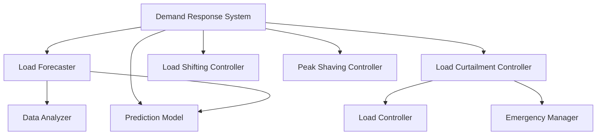

# Demand Response System Documentation

## Overview
The Demand Response System (DRS) manages load forecasting, curtailment control, and demand-side management for the KPP simulator. It enables efficient load management and grid stability through predictive analytics and controlled load reduction.

## Features
- Load forecasting and prediction
- Curtailment control
- Peak shaving
- Load shifting
- Emergency response
- Performance monitoring

## System Architecture

### Components


## Configuration

### Basic Configuration
```python
DEMAND_RESPONSE_CONFIG = {
    # Forecasting parameters
    'forecast_horizon': 24,       # hours
    'update_interval': 900,      # seconds (15 minutes)
    'prediction_confidence': 0.95, # 95% confidence interval
    
    # Curtailment parameters
    'min_reduction': 50.0,       # kW
    'max_reduction': 200.0,      # kW
    'ramp_rate': 10.0,          # kW/minute
    'min_notice': 300,          # seconds
    
    # Load management
    'peak_threshold': 800.0,     # kW
    'recovery_factor': 0.8,      # 80% recovery allowed
    'max_curtailment_time': 7200 # seconds (2 hours)
}
```

### Advanced Configuration
```python
ADVANCED_CONFIG = {
    # Load forecasting
    'forecasting': {
        'model_type': 'lstm',     # or 'prophet', 'arima'
        'features': [
            'time_of_day',
            'day_of_week',
            'temperature',
            'humidity'
        ],
        'training_window': 30,    # days
        'validation_split': 0.2
    },
    
    # Curtailment strategies
    'curtailment': {
        'priority_loads': [
            'critical_process_1',
            'life_safety_systems',
            'essential_services'
        ],
        'non_curtailable_load': 200.0,  # kW
        'max_events_per_day': 2,
        'min_recovery_time': 3600       # seconds
    },
    
    # Peak shaving
    'peak_shaving': {
        'target_reduction': 100.0,      # kW
        'look_ahead_window': 4,         # hours
        'cost_threshold': 50.0          # $/MWh
    }
}
```

## Usage Examples

### Load Forecasting

#### Initialize Forecaster
```python
from kpp_simulator.grid_services.demand_response.load_forecaster import LoadForecaster

# Create forecaster
forecaster = LoadForecaster(
    model_type='lstm',
    features=['time_of_day', 'temperature']
)

# Train model
forecaster.train(
    historical_data=load_history,
    weather_data=weather_history
)
```

#### Generate Forecasts
```python
# Short-term forecast
hourly_forecast = forecaster.forecast_load(
    horizon=24,
    interval='1H'
)

# Daily forecast
daily_forecast = forecaster.forecast_load(
    horizon=7,
    interval='1D'
)

# Get forecast accuracy
accuracy = forecaster.evaluate_forecast_accuracy(
    actual_values=actual_load,
    forecasted_values=hourly_forecast
)
```

### Load Curtailment

#### Initialize Controller
```python
from kpp_simulator.grid_services.demand_response.load_curtailment_controller import LoadCurtailmentController

# Create controller
controller = LoadCurtailmentController(
    electrical_system=electrical_system,
    control_system=control_system
)

# Configure curtailment
controller.configure(
    min_reduction=50.0,
    max_reduction=200.0,
    ramp_rate=10.0
)
```

#### Manage Curtailment
```python
# Activate curtailment
success = controller.activate_curtailment(
    target_reduction=100.0,
    duration=timedelta(hours=2),
    ramp_time=timedelta(minutes=15)
)

# Monitor progress
status = controller.get_curtailment_status()
print(f"Current reduction: {status.achieved_reduction} kW")
print(f"Time remaining: {status.remaining_time} seconds")

# Deactivate curtailment
controller.deactivate_curtailment(
    ramp_time=timedelta(minutes=15)
)
```

### Peak Shaving

#### Configure Peak Shaving
```python
# Setup peak shaving
controller.configure_peak_shaving(
    peak_threshold=800.0,
    reduction_target=50.0,
    recovery_factor=0.8
)

# Activate peak shaving
controller.activate_peak_shaving(
    duration=timedelta(hours=4)
)
```

### Emergency Response

#### Configure Emergency Response
```python
# Setup emergency response
controller.configure_emergency_response(
    priority_loads=['critical_process_1'],
    max_reduction=300.0,
    response_time=timedelta(minutes=5)
)

# Execute emergency response
response = controller.execute_emergency_response(
    required_reduction=200.0
)
```

## Performance Monitoring

### Real-time Monitoring
```python
# Get current metrics
metrics = controller.get_performance_metrics()
print(f"Total energy reduced: {metrics['total_energy_reduced']} kWh")
print(f"Average response time: {metrics['average_response_time']} seconds")
print(f"Customer satisfaction: {metrics['customer_satisfaction']}")

# Get detailed status
status = controller.get_detailed_status()
for load in status.loads:
    print(f"Load {load.id}: {load.current_power} kW")
```

### Historical Analysis
```python
# Get historical performance
history = controller.get_performance_history(
    start_time=datetime.now() - timedelta(days=7),
    end_time=datetime.now()
)

# Analyze curtailment events
events = controller.analyze_curtailment_events(
    time_period=timedelta(days=30)
)
```

## Optimization Strategies

### Load Management
1. **Predictive Control**
   - Use load forecasts for planning
   - Implement gradual reductions
   - Balance multiple objectives

2. **Customer Impact**
   - Minimize disruption
   - Rotate curtailment targets
   - Provide advance notice

3. **Economic Optimization**
   - Target high-cost periods
   - Maximize revenue opportunities
   - Consider market conditions

## Troubleshooting

### Common Issues

#### Forecasting Issues
1. **Symptom**: Poor accuracy
   - Check input data quality
   - Verify feature selection
   - Update model parameters

2. **Symptom**: Delayed predictions
   - Check processing pipeline
   - Optimize model complexity
   - Review data preprocessing

#### Curtailment Issues
1. **Symptom**: Insufficient reduction
   ```python
   # Diagnose curtailment
   diagnosis = controller.diagnose_curtailment()
   
   # Adjust parameters if needed
   if diagnosis.needs_adjustment:
       controller.adjust_parameters(diagnosis.recommendations)
   ```

2. **Symptom**: Customer complaints
   ```python
   # Review customer impact
   impact = controller.analyze_customer_impact()
   
   # Adjust strategy
   controller.optimize_customer_satisfaction(
       impact_analysis=impact
   )
   ```

### Emergency Procedures

#### System Recovery
```python
# Emergency reset
controller.emergency_reset()

# Gradual recovery
controller.recover_normal_operation(
    recovery_time=timedelta(minutes=30)
)
```

## Best Practices

1. **Forecasting**
   - Regularly update models
   - Include relevant features
   - Monitor forecast accuracy

2. **Curtailment**
   - Use gradual reductions
   - Rotate curtailment targets
   - Monitor customer impact

3. **Emergency Response**
   - Maintain priority lists
   - Test response regularly
   - Document procedures

4. **Performance Optimization**
   - Regular system tuning
   - Monitor key metrics
   - Update strategies based on results 