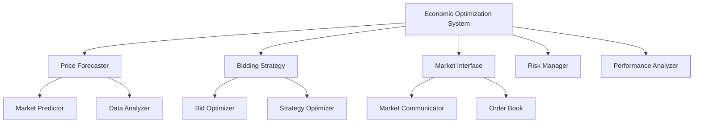

# Economic Optimization System Documentation

## Overview
The Economic Optimization System (EOS) manages market participation, bidding strategies, and revenue optimization for the KPP simulator. It integrates price forecasting, risk management, and market interface components to maximize economic value while maintaining system reliability.

## Features
- Market participation strategies
- Price forecasting
- Bidding optimization
- Revenue maximization
- Risk management
- Performance analytics

## System Architecture

### Components


## Configuration

### Basic Configuration
```python
ECONOMIC_CONFIG = {
    # Market parameters
    'market_update_interval': 300,    # seconds
    'min_bid_size': 100.0,           # kW
    'max_bid_size': 500.0,           # kW
    'price_threshold': 50.0,         # $/MWh
    
    # Trading parameters
    'min_profit_margin': 0.1,        # 10%
    'max_position_size': 1000.0,     # kW
    'position_duration': 3600,       # seconds
    
    # Risk parameters
    'risk_tolerance': 0.2,           # 20%
    'max_drawdown': 0.1,             # 10%
    'stop_loss': 0.05                # 5%
}
```

### Advanced Configuration
```python
ADVANCED_CONFIG = {
    # Price forecasting
    'forecasting': {
        'model_type': 'lstm',
        'features': [
            'time_of_day',
            'day_of_week',
            'demand',
            'temperature',
            'historical_prices'
        ],
        'forecast_horizon': 24,      # hours
        'confidence_interval': 0.95
    },
    
    # Bidding strategy
    'bidding': {
        'strategy_type': 'adaptive',
        'price_increment': 0.5,      # $/MWh
        'volume_increment': 10.0,    # kW
        'max_bid_adjustments': 5,
        'bid_validity': 300          # seconds
    },
    
    # Risk management
    'risk': {
        'var_confidence': 0.99,
        'position_limits': {
            'hourly': 1000.0,        # kW
            'daily': 5000.0,         # kW
            'weekly': 20000.0        # kW
        },
        'hedging_instruments': [
            'futures',
            'options',
            'swaps'
        ]
    }
}
```

## Usage Examples

### Price Forecasting

#### Initialize Forecaster
```python
from kpp_simulator.grid_services.economic.price_forecaster import PriceForecaster

# Create forecaster
forecaster = PriceForecaster(
    model_type='lstm',
    features=['time_of_day', 'demand']
)

# Train model
forecaster.train(
    historical_prices=price_history,
    market_data=market_history
)
```

#### Generate Forecasts
```python
# Short-term forecast
hourly_forecast = forecaster.predict_prices(
    horizon=24,
    interval='1H'
)

# Get forecast confidence
confidence = forecaster.get_forecast_confidence(
    forecast=hourly_forecast
)

# Update model
forecaster.update_model(
    new_prices=recent_prices,
    market_data=recent_market_data
)
```

### Bidding Strategy

#### Initialize Strategy
```python
from kpp_simulator.grid_services.economic.bidding_strategy import BiddingStrategy

# Create strategy
strategy = BiddingStrategy(
    market_interface=market_interface,
    price_forecaster=price_forecaster
)

# Configure strategy
strategy.configure(
    min_profit_margin=0.1,
    max_position_size=1000.0,
    risk_tolerance=0.2
)
```

#### Optimize Bids
```python
# Generate optimal bid
bid = strategy.optimize_bid(
    available_capacity=100.0,
    market_conditions=market_data
)

# Adjust bid based on competition
adjusted_bid = strategy.adjust_bid(
    original_bid=bid,
    competitor_bids=competitor_data
)

# Submit bid
success = strategy.submit_bid(
    bid=adjusted_bid,
    validity_period=timedelta(minutes=5)
)
```

### Market Interface

#### Initialize Interface
```python
from kpp_simulator.grid_services.economic.market_interface import MarketInterface

# Create interface
interface = MarketInterface(
    market_id='energy_market_1',
    participant_id='kpp_plant_1'
)

# Connect to market
interface.connect(
    credentials=market_credentials,
    timeout=30
)
```

#### Market Operations
```python
# Get market data
market_data = interface.get_market_data(
    data_type='orderbook',
    depth=5
)

# Submit order
order_id = interface.submit_order(
    price=45.0,
    volume=100.0,
    direction='sell'
)

# Monitor order
status = interface.get_order_status(
    order_id=order_id
)
```

### Risk Management

#### Risk Assessment
```python
# Calculate portfolio risk
risk = strategy.assess_portfolio_risk(
    positions=current_positions,
    market_volatility=0.2
)

# Get risk metrics
metrics = strategy.get_risk_metrics()
print(f"Value at Risk: {metrics['var_95']}")
print(f"Expected Shortfall: {metrics['expected_shortfall']}")
```

#### Risk Mitigation
```python
# Get hedging strategy
hedging = strategy.get_hedging_strategy(
    risk_assessment=risk,
    available_instruments=['futures', 'options']
)

# Implement hedging
success = strategy.implement_hedging(
    strategy=hedging
)
```

## Performance Monitoring

### Real-time Monitoring
```python
# Get trading performance
performance = strategy.get_trading_performance()
print(f"Total Revenue: {performance['total_revenue']}")
print(f"Average Price: {performance['average_price']}")
print(f"Success Rate: {performance['success_rate']}")

# Monitor positions
positions = interface.get_current_positions()
for position in positions:
    print(f"Position {position.id}: {position.volume} kW @ {position.price}")
```

### Historical Analysis
```python
# Get trading history
history = strategy.get_trading_history(
    start_time=datetime.now() - timedelta(days=30),
    end_time=datetime.now()
)

# Analyze performance
analysis = strategy.analyze_performance(
    trading_history=history
)
```

## Optimization Strategies

### Revenue Optimization
1. **Price-based Optimization**
   - Monitor price trends
   - Identify optimal trading windows
   - Adjust bid prices dynamically

2. **Volume Optimization**
   - Balance available capacity
   - Consider system constraints
   - Optimize position sizes

3. **Risk-adjusted Returns**
   - Calculate risk-adjusted metrics
   - Implement hedging strategies
   - Maintain risk limits

## Troubleshooting

### Common Issues

#### Market Connection Issues
1. **Symptom**: Connection failures
   - Check network connectivity
   - Verify credentials
   - Monitor market status

2. **Symptom**: Order rejection
   - Verify order parameters
   - Check position limits
   - Review market rules

#### Strategy Issues
1. **Symptom**: Poor performance
   ```python
   # Diagnose strategy
   diagnosis = strategy.diagnose_performance()
   
   # Adjust parameters
   if diagnosis.needs_adjustment:
       strategy.adjust_parameters(diagnosis.recommendations)
   ```

2. **Symptom**: High risk exposure
   ```python
   # Review risk levels
   risk_analysis = strategy.analyze_risk_exposure()
   
   # Adjust risk parameters
   strategy.adjust_risk_parameters(
       risk_analysis=risk_analysis
   )
   ```

### Emergency Procedures

#### Market Disruption
```python
# Emergency market exit
strategy.emergency_exit_positions()

# Switch to safe mode
strategy.enable_safe_mode(
    max_position=50.0,
    min_profit_margin=0.2
)
```

## Best Practices

1. **Market Participation**
   - Monitor market conditions
   - Maintain bid/offer spreads
   - Follow market rules

2. **Risk Management**
   - Set position limits
   - Implement stop losses
   - Monitor exposure

3. **Performance Optimization**
   - Regular strategy review
   - Update models frequently
   - Monitor key metrics

4. **System Integration**
   - Coordinate with other services
   - Maintain data quality
   - Regular system checks 